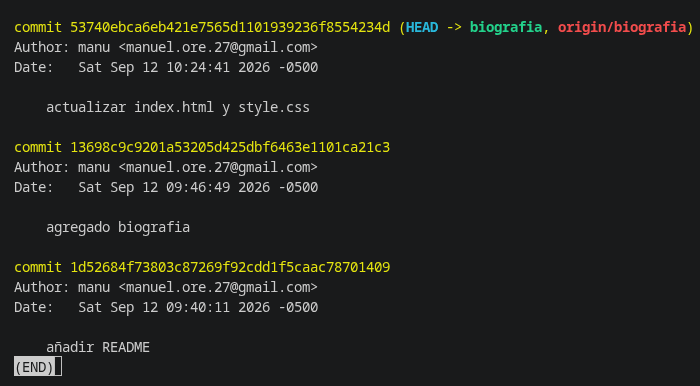
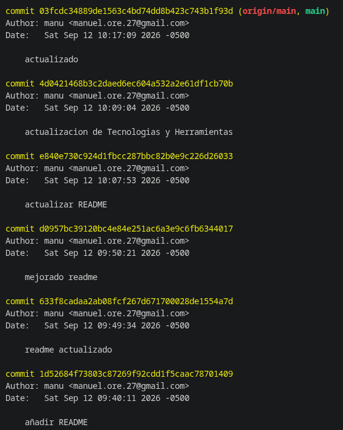

# Repositorio Personal — Manuel Ore Huasaja

<p align="left">
  
  
  
  
</p>

Repositorio centralizado para el almacenamiento, control de versiones y despliegue de mis proyectos académicos, profesionales y páginas de presentación personal. 

---

## 🛠️ Estructura del Repositorio

| Rama | Descripción y Propósito |
| :--- | :--- |
| **`main`** | Rama principal que contiene este archivo `README.md` como documentación raíz y visión general del repositorio. |
| **`biografia`** | Rama dedicada al sitio web de presentación personal (**HTML5** y **CSS3**), que detalla mi perfil académico y trayectoria formativa. |

---

## 🎓 Perfil Académico

| Componente | Detalle |
| :--- | :--- |
| **Ocupación** | Estudiante de Ingeniería de Sistemas |
| **Institución Superior** | **Universidad Nacional San Cristóbal de Huamanga (UNSCH)** — Facultad de Ingeniería |
| **Educación Secundaria** | Colegio Emblemático Mariscal Cáceres |
| **Ubicación** | Ayacucho, Perú |

---

## 🚀 Tecnologías y Herramientas

Enfocado en el desarrollo de software, modelado de bases de datos, algoritmos y buenas prácticas de ingeniería:

| Categoría | Herramientas / Tecnologías |
| :--- | :--- |
| **Lenguajes de Programación** | Python, C++, Java, JavaScript |
| **Desarrollo Web** | HTML5, CSS3 (Diseño responsivo y metodologías modernas) |
| **Simulación de Redes** | GNS3, imágenes Checkpoint, Aruba, etc. |
| **Control de Versiones** | Git & GitHub |
| **Sistemas Operativos** | Entornos Linux |

---

## 🗂️ Cómo visualizar la biografía personal

Para ver la página web personal alojada en este repositorio, cambia a la rama correspondiente ejecutando el siguiente comando en tu terminal:

```bash
git checkout biografia
git log biografia
```

---

## 🧾 Historial de cambios por rama

El historial del proyecto se organiza en dos ramas principales. La rama `main` contiene la documentación general del repositorio y la rama `biografia` contiene la página web personal.

### Rama `biografia`

Consulta utilizada:

```bash
git log biografia
```

| Commit | Fecha | Cambio |
| :--- | :--- | :--- |
| `53740eb` | 12 de septiembre de 2026, 10:24 | Actualizar `index.html` y `style.css` |
| `13698c9` | 12 de septiembre de 2026, 09:46 | Agregar biografía |
| `1d52684` | 12 de septiembre de 2026, 09:40 | Añadir `README.md` |

<p align="center">
  
</p>

### Rama `main`

Consulta utilizada:

```bash
git log main
```

| Commit | Fecha | Cambio |
| :--- | :--- | :--- |
| `03fcdc3` | 12 de septiembre de 2026, 10:17 | Actualizar repositorio |
| `4d04214` | 12 de septiembre de 2026, 10:09 | Actualizar tecnologías y herramientas |
| `e840e73` | 12 de septiembre de 2026, 10:07 | Actualizar `README.md` |
| `d0957bc` | 12 de septiembre de 2026, 09:50 | Mejorar README |
| `633f8ca` | 12 de septiembre de 2026, 09:49 | Actualizar README |
| `1d52684` | 12 de septiembre de 2026, 09:40 | Añadir `README.md` |

<p align="center">
  
</p>

> Nota: los identificadores cortos de commit y la información mostrada corresponden al historial registrado en las capturas incluidas en este repositorio.